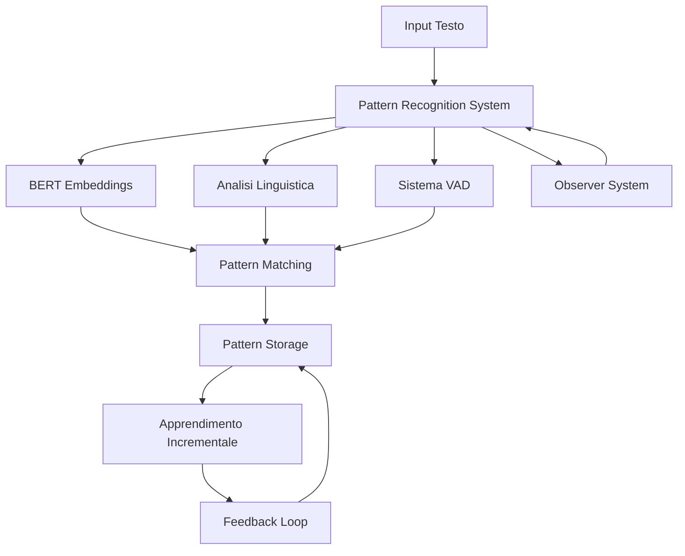
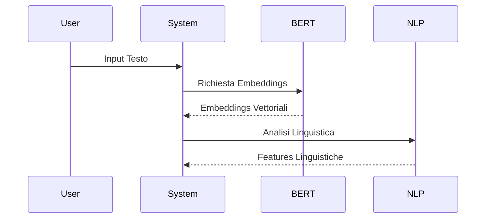
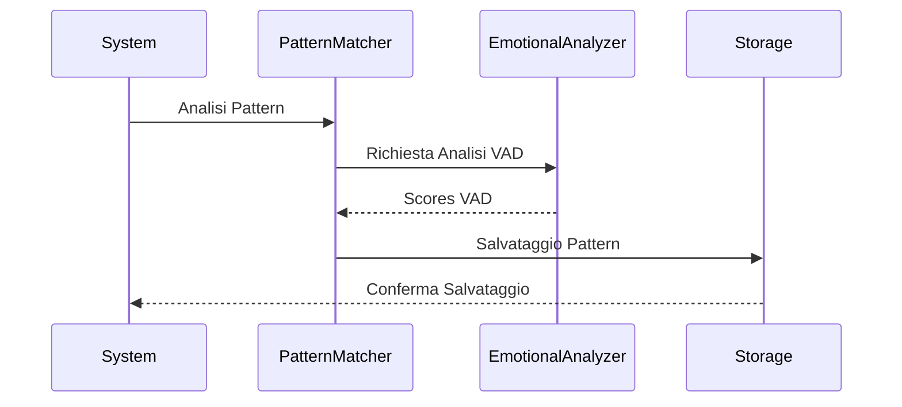
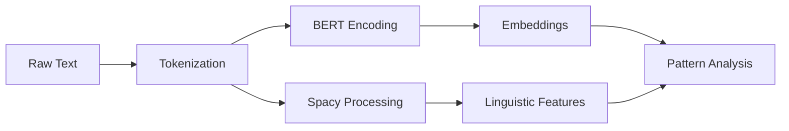
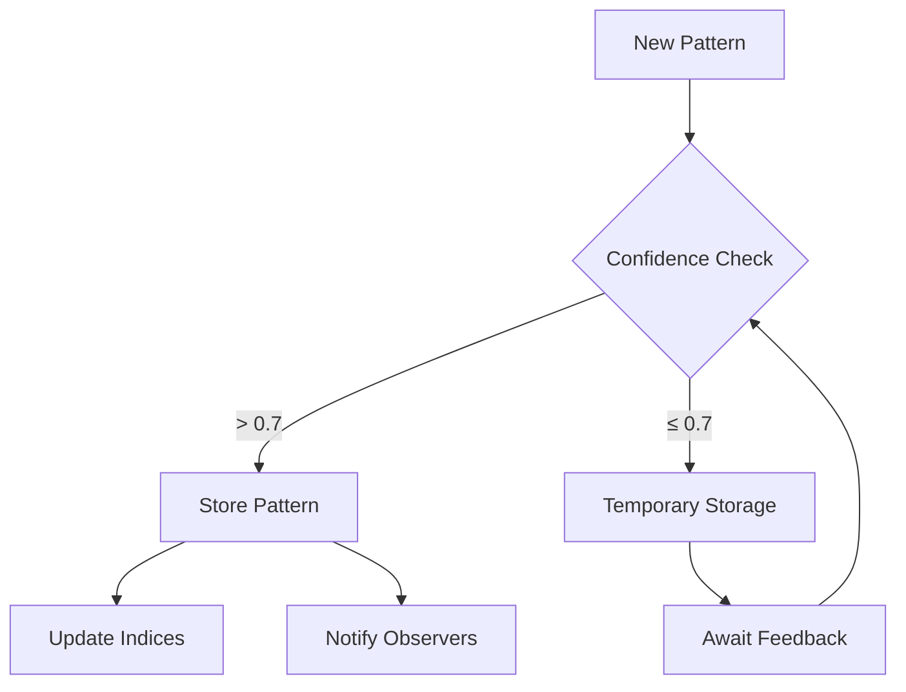

# Architettura Tecnica del Sistema di Apprendimento Incrementale

## 1. Architettura del Sistema



## 2. Flusso dei Dati

### 2.1 Preprocessing


### 2.2 Pattern Recognition


## 3. Componenti Core

### 3.1 Pattern Recognition System
```python
class PatternRecognitionSystem:
    def __init__(self):
        self.tokenizer = AutoTokenizer.from_pretrained("dbmdz/bert-base-italian-xxl-uncased")
        self.model = AutoModel.from_pretrained("dbmdz/bert-base-italian-xxl-uncased")
        self.nlp = spacy.load("it_core_news_sm")
        self.observers = []
        self.pattern_history = []
        self.known_patterns = {}
```

### 3.2 Emotional System
```python
class EmotionalSystem:
    def __init__(self):
        self.vad_lexicon = load_vad_lexicon()
        self.emotion_patterns = compile_emotion_patterns()
        self.intensity_calculator = EmotionalIntensityCalculator()
```

### 3.3 Pattern Storage
```python
class PatternStorage:
    def __init__(self):
        self.patterns = {}
        self.embeddings_index = {}
        self.topic_index = defaultdict(list)
```

## 4. Pipeline di Elaborazione

### 4.1 Input Processing


### 4.2 Pattern Learning


## 5. Sistemi di Feedback

### 5.1 Feedback Loop
```python
def process_feedback(self, pattern: Pattern, feedback: Dict[str, Any]):
    # Aggiorna confidence
    if 'confidence_score' in feedback:
        pattern.confidence = self._update_confidence(
            pattern.confidence,
            feedback['confidence_score']
        )
    
    # Aggiorna topic se necessario
    if 'suggested_topic' in feedback:
        self._update_topic(pattern, feedback['suggested_topic'])
    
    # Notifica observers
    self._notify_observers('pattern_updated', {
        'pattern': pattern,
        'feedback': feedback
    })
```

### 5.2 Learning Rate Adjustment
```python
def adjust_learning_rate(self, pattern: Pattern, feedback_history: List[float]):
    """Aggiusta il learning rate basato sulla storia del feedback"""
    recent_feedback = feedback_history[-10:]  # Ultimi 10 feedback
    variance = np.var(recent_feedback)
    
    if variance < 0.1:  # Feedback consistente
        return min(0.1, pattern.learning_rate * 1.2)
    else:  # Feedback inconsistente
        return max(0.01, pattern.learning_rate * 0.8)
```

## 6. Metriche di Performance

### 6.1 Pattern Recognition
- Accuracy di riconoscimento topic
- Precisione nella similarità
- Recall dei pattern rilevanti

### 6.2 Emotional Analysis
- Accuratezza VAD
- Consistenza temporale
- Correlazione con feedback umano

## 7. Ottimizzazioni

### 7.1 Caching System
```python
class PatternCache:
    def __init__(self, capacity: int = 1000):
        self.capacity = capacity
        self.cache = OrderedDict()
        
    def get(self, key: str) -> Optional[Pattern]:
        if key in self.cache:
            self.cache.move_to_end(key)
            return self.cache[key]
        return None
        
    def put(self, key: str, pattern: Pattern):
        if key in self.cache:
            self.cache.move_to_end(key)
        else:
            if len(self.cache) >= self.capacity:
                self.cache.popitem(last=False)
        self.cache[key] = pattern
```

### 7.2 Batch Processing
```python
def process_batch(self, texts: List[str]) -> List[Pattern]:
    # Tokenizzazione batch
    encodings = self.tokenizer(
        texts,
        padding=True,
        truncation=True,
        return_tensors="pt"
    )
    
    # Generazione embeddings batch
    with torch.no_grad():
        outputs = self.model(**encodings)
        embeddings = outputs.last_hidden_state[:, 0, :]
    
    # Processamento parallelo
    patterns = []
    with ThreadPoolExecutor() as executor:
        pattern_futures = [
            executor.submit(self._create_pattern, text, embedding)
            for text, embedding in zip(texts, embeddings)
        ]
        patterns = [future.result() for future in pattern_futures]
    
    return patterns
```

## 8. Integrazione con Altri Sistemi

### 8.1 API Endpoints
```python
@app.route('/api/analyze', methods=['POST'])
def analyze_text():
    text = request.json['text']
    pattern = pattern_system.analyze_pattern(text)
    return jsonify({
        'topic': pattern.topic,
        'confidence': pattern.confidence,
        'sentiment': pattern.metadata['sentiment']
    })
```

### 8.2 Event System
```python
class EventSystem:
    def __init__(self):
        self.handlers = defaultdict(list)
        
    def subscribe(self, event_type: str, handler: Callable):
        self.handlers[event_type].append(handler)
        
    def emit(self, event_type: str, data: Any):
        for handler in self.handlers[event_type]:
            handler(data)
```

## 9. Testing e Monitoring

### 9.1 Performance Monitoring
```python
class SystemMonitor:
    def __init__(self):
        self.metrics = defaultdict(list)
        self.start_time = time.time()
        
    def log_metric(self, metric_name: str, value: float):
        self.metrics[metric_name].append({
            'value': value,
            'timestamp': time.time()
        })
        
    def get_statistics(self) -> Dict[str, Any]:
        return {
            name: {
                'mean': np.mean([m['value'] for m in measures]),
                'std': np.std([m['value'] for m in measures]),
                'count': len(measures)
            }
            for name, measures in self.metrics.items()
        }
```

### 9.2 Automated Testing
```python
class TestSuite:
    def __init__(self, system: PatternRecognitionSystem):
        self.system = system
        self.test_cases = []
        
    def add_test_case(self, input_text: str, expected_output: Dict[str, Any]):
        self.test_cases.append({
            'input': input_text,
            'expected': expected_output
        })
        
    def run_tests(self) -> TestResults:
        results = []
        for case in self.test_cases:
            pattern = self.system.analyze_pattern(case['input'])
            results.append(self._compare_results(pattern, case['expected']))
        return TestResults(results)
```

## 10. Future Sviluppi

### 10.1 Planned Features
- Supporto multilingua
- Analisi sentiment avanzata
- Pattern clustering automatico
- Ottimizzazione memoria

### 10.2 Research Areas
- Deep learning per pattern recognition
- Emotional intelligence avanzata
- Transfer learning
- Unsupervised pattern discovery
