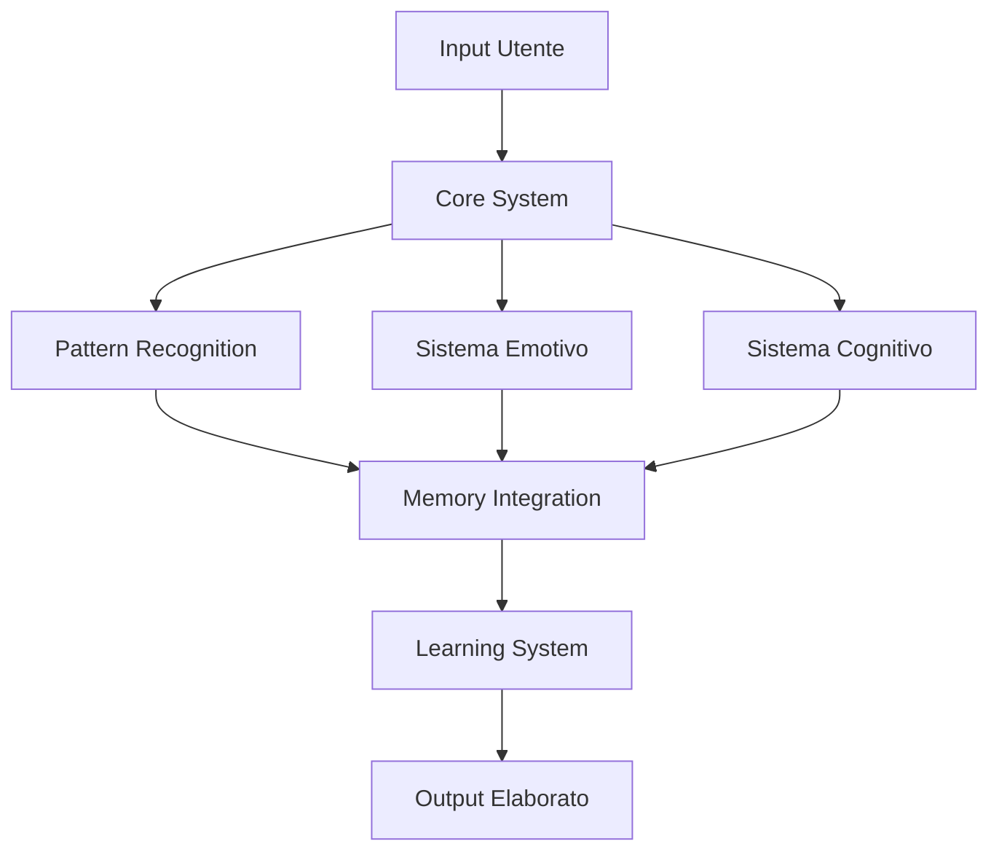
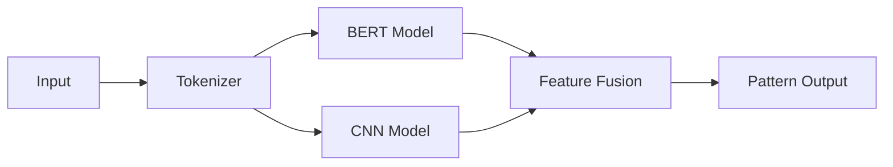
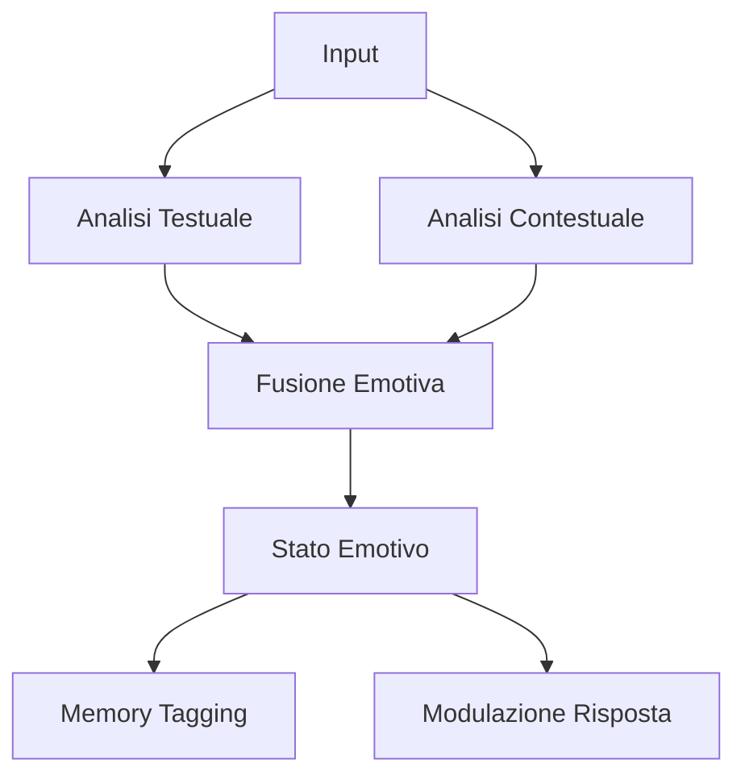
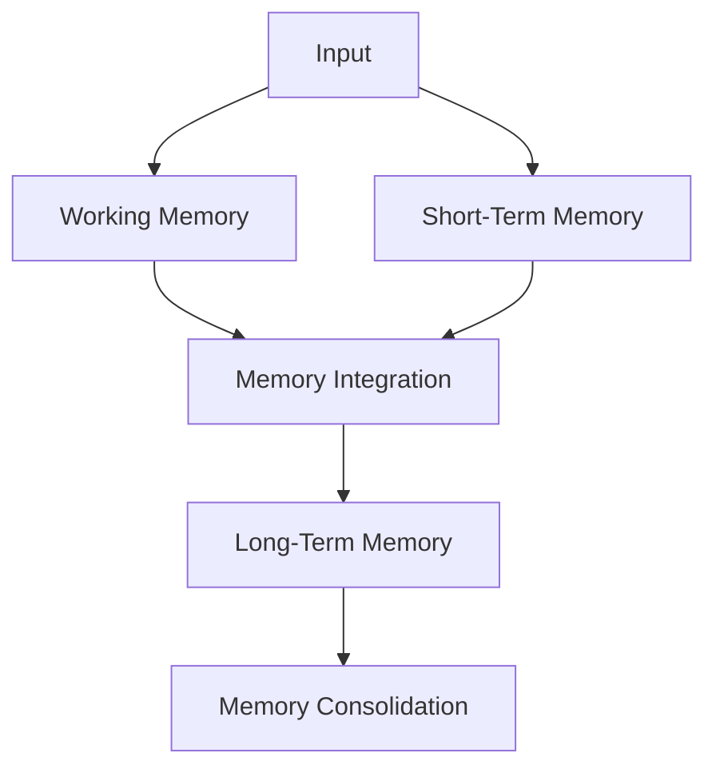
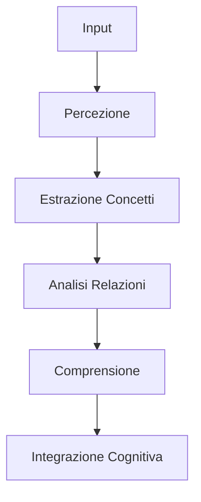
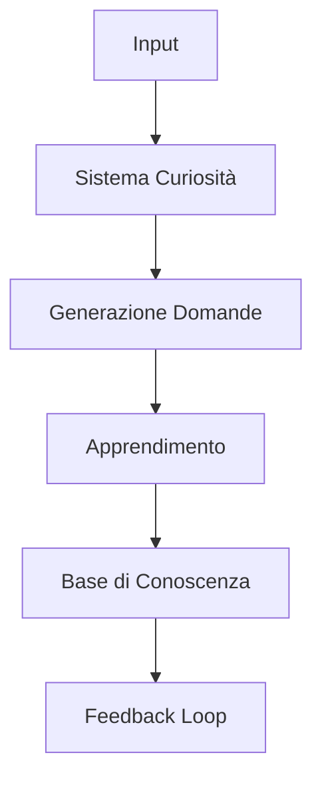
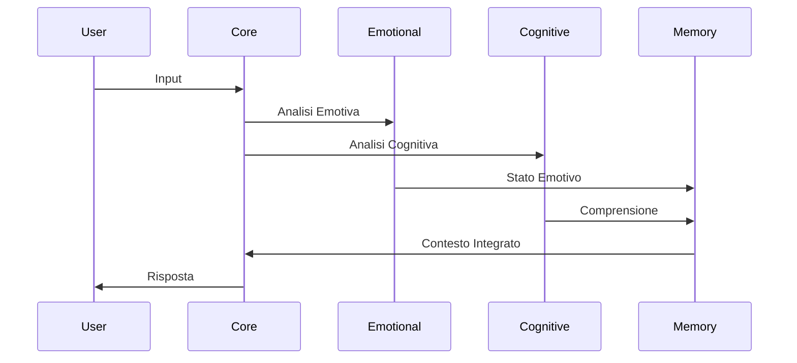

# Architettura ALLMA

## 1. Overview Architetturale

### 1.1 Struttura Generale


### 1.2 Componenti Core
```python
CORE_COMPONENTS = {
    'pattern_recognition': {
        'type': 'preprocessing',
        'models': ['BERT', 'CNN', 'LSTM'],
        'input': 'raw_text',
        'output': 'features'
    },
    'emotional_system': {
        'type': 'analysis',
        'models': ['EmotionDetector', 'ValenceAnalyzer'],
        'input': 'processed_text',
        'output': 'emotional_state'
    },
    'cognitive_system': {
        'type': 'processing',
        'models': ['ConceptExtractor', 'RelationAnalyzer'],
        'input': 'features',
        'output': 'understanding'
    },
    'memory_system': {
        'type': 'storage',
        'components': ['WorkingMemory', 'LongTermMemory'],
        'input': 'processed_data',
        'output': 'recalled_info'
    }
}
```

## 2. Sistema di Pattern Recognition

### 2.1 Architettura Pattern Recognition


### 2.2 Configurazione Modelli
```python
PATTERN_MODELS = {
    'bert': {
        'model': 'bert-base-multilingual-cased',
        'max_length': 512,
        'batch_size': 32,
        'layers_to_use': [-1, -2, -3, -4]
    },
    'cnn': {
        'architecture': [
            {'type': 'conv1d', 'filters': 128, 'kernel_size': 3},
            {'type': 'maxpool1d', 'pool_size': 2},
            {'type': 'conv1d', 'filters': 256, 'kernel_size': 3},
            {'type': 'global_maxpool1d'}
        ],
        'embedding_dim': 300
    }
}
```

## 3. Sistema Emotivo

### 3.1 Architettura Emotiva


### 3.2 Configurazione Emozioni
```python
EMOTION_CONFIG = {
    'primary_emotions': {
        'joy': {'valence': 0.8, 'arousal': 0.6},
        'sadness': {'valence': -0.7, 'arousal': -0.4},
        'anger': {'valence': -0.6, 'arousal': 0.8},
        'fear': {'valence': -0.8, 'arousal': 0.7}
    },
    'emotion_fusion': {
        'text_weight': 0.6,
        'context_weight': 0.4,
        'history_weight': 0.2,
        'decay_rate': 0.1
    }
}
```

## 4. Sistema di Memoria

### 4.1 Architettura Memoria


### 4.2 Configurazione Memoria
```python
MEMORY_CONFIG = {
    'working_memory': {
        'capacity': 7,
        'retention_time': 30,  # seconds
        'priority_levels': 3
    },
    'short_term': {
        'capacity': 100,
        'retention_time': 300,  # seconds
        'cleanup_interval': 60  # seconds
    },
    'long_term': {
        'max_size': '1GB',
        'consolidation_interval': 3600,  # seconds
        'importance_threshold': 0.7
    }
}
```

## 5. Sistema Cognitivo

### 5.1 Architettura Cognitiva


### 5.2 Pipeline Cognitiva
```python
COGNITIVE_PIPELINE = {
    'perception': {
        'input_processing': ['tokenization', 'pos_tagging', 'dependency_parsing'],
        'feature_extraction': ['syntactic', 'semantic', 'contextual']
    },
    'concept_extraction': {
        'methods': ['entity_recognition', 'keyword_extraction', 'topic_modeling'],
        'confidence_threshold': 0.7
    },
    'relation_analysis': {
        'types': ['hierarchical', 'temporal', 'causal', 'spatial'],
        'max_distance': 5
    }
}
```

## 6. Sistema di Apprendimento

### 6.1 Architettura Apprendimento


### 6.2 Configurazione Apprendimento
```python
LEARNING_CONFIG = {
    'curiosity': {
        'exploration_rate': 0.2,
        'novelty_threshold': 0.6,
        'reward_decay': 0.9
    },
    'question_generation': {
        'max_questions': 3,
        'complexity_levels': ['simple', 'medium', 'complex'],
        'context_window': 5
    },
    'knowledge_integration': {
        'confidence_threshold': 0.8,
        'validation_required': True,
        'consolidation_steps': 3
    }
}
```

## 7. Integrazione dei Sistemi

### 7.1 Flusso di Comunicazione


### 7.2 Protocollo di Comunicazione
```python
COMMUNICATION_PROTOCOL = {
    'message_format': {
        'id': 'uuid',
        'timestamp': 'iso8601',
        'source': 'component_id',
        'destination': 'component_id',
        'payload': 'json',
        'priority': 'int'
    },
    'routing': {
        'sync_timeout': 1000,  # ms
        'retry_count': 3,
        'buffer_size': 100
    }
}
```

## 8. Gestione delle Risorse

### 8.1 Allocazione Memoria
```python
RESOURCE_ALLOCATION = {
    'memory_pools': {
        'working_memory': '256MB',
        'processing_buffer': '512MB',
        'model_cache': '1GB'
    },
    'cpu_allocation': {
        'pattern_recognition': 2,
        'emotional_processing': 1,
        'cognitive_processing': 2,
        'memory_management': 1
    }
}
```

### 8.2 Ottimizzazione
```python
OPTIMIZATION_CONFIG = {
    'caching': {
        'pattern_cache_size': 1000,
        'emotion_cache_size': 500,
        'response_cache_size': 200
    },
    'batch_processing': {
        'max_batch_size': 32,
        'accumulation_time': 100  # ms
    },
    'resource_limits': {
        'max_memory': '4GB',
        'max_cpu_usage': 0.8,
        'max_gpu_memory': '2GB'
    }
}
```

## 9. Monitoraggio e Diagnostica

### 9.1 Metriche di Sistema
```python
MONITORING_CONFIG = {
    'performance_metrics': {
        'response_time': {'warning': 200, 'critical': 500},  # ms
        'memory_usage': {'warning': 80, 'critical': 90},     # %
        'processing_load': {'warning': 70, 'critical': 85}   # %
    },
    'health_checks': {
        'interval': 60,  # seconds
        'timeout': 5,    # seconds
        'components': ['core', 'emotional', 'cognitive', 'memory']
    }
}
```

### 9.2 Sistema di Logging
```python
LOGGING_CONFIG = {
    'levels': {
        'debug': {'retention': '2d', 'max_size': '100MB'},
        'info': {'retention': '7d', 'max_size': '500MB'},
        'error': {'retention': '30d', 'max_size': '1GB'}
    },
    'metrics_collection': {
        'interval': 10,  # seconds
        'aggregation_window': 300  # seconds
    }
}
```

## 10. Sicurezza e Protezione

### 10.1 Configurazione Sicurezza
```python
SECURITY_CONFIG = {
    'encryption': {
        'algorithm': 'AES-256-GCM',
        'key_rotation': '30d',
        'storage_encryption': True
    },
    'access_control': {
        'authentication': 'token_based',
        'session_timeout': 3600,
        'max_failed_attempts': 3
    }
}
```

### 10.2 Protezione Dati
```python
DATA_PROTECTION = {
    'sensitive_data': {
        'encryption_required': True,
        'anonymization': True,
        'retention_period': '90d'
    },
    'backup': {
        'interval': '24h',
        'retention': '30d',
        'encryption': True
    }
}
